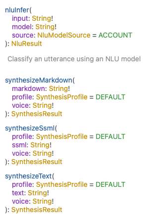

A set of tools for integration with the [Spokestack API](https://spokestack.io) in Node.js [](https://circleci.com/gh/spokestack/node-spokestack)

## Installation

```bash
$ npm install spokestack --save
```

## Features

Spokestack has all the tools you need to build amazing user experiences for speech. Here are some of the features included in node-spokestack:

- Automatic Speech Recognition (ASR): We provide multiple ways to hook up either [Spokestack ASR](https://www.spokestack.io/docs/concepts/asr) or [Google Cloud Speech](https://github.com/googleapis/nodejs-speech) to your node/express server, including asr functions for one-off ASR requests and websocket server integrations for ASR streaming. Or, use the ASR services directly for more advanced integrations.
- Speech-to-Text: Through the use of our [GraphQL](https://graphql.org) API (see below), Spokestack offers multiple ways to generate voice audio from text. Send raw text, [speech markdown](https://www.speechmarkdown.org), or [SSML](https://en.wikipedia.org/wiki/Speech_Synthesis_Markup_Language) and get back a URL for audio to play in the browser.
- Wake word and Keyword: Wake word and keyword processing are supported through the use of our speech pipeline (see [startPipeline](#startPipeline)). One of the most powerful features we provide is the ability to define and train custom wake word and keyword models directly on [spokestack.io](https://www.spokestack.io/account). When training is finished, we host the model files for you on a CDN. Pass the CDN URLs to `startPipeline()` and the Speech Pipeline will start listening These same models can be used in [spokestack-python](https://github.com/spokestack/spokestack-python), [spokestack-android](https://github.com/spokestack/spokestack-android), [spokestack-ios](https://github.com/spokestack/spokestack-ios), and [react-native-spokestack](https://github.com/spokestack/react-native-spokestack). The pipeline uses a web worker in the browser to keep all of the speech processing off the main thread so your UI never gets blocked. **NOTE: The speech pipeline (specifically tensorflow's webgl backend) currently only works in Blink browsers (Chrome, Edge, Opera, Vivaldi, Brave, and most Android browsers) as it requires the use of the experimental [OffscreenCanvas API](https://caniuse.com/?search=offscreencanvas). Firefox is close to full support for that API, and we'll look into supporting Firefox when that's available.**
- Natural Language Understanding (NLU): The [GraphQL](https://graphql.org) API (see below) also provides a way to convert the text from ASR to actionable "intents", or functions that apps can understand. For instance, if a user says, "Find a recipe for chocolate cake", an NLU might return a "SEARCH_RECIPE" intent. To use the NLU, you'll need an NLU model. While we have plans to release an NLU editor, the best way right now to create an NLU model is to use Alexa, DialogFlow, or Jovo and [upload the exported model to your Spokestack account](https://www.spokestack.io/docs/concepts/export). We support exports from all of those platforms.

**This repo includes [an example app](examples/with-next) that demonstrates ASR, speech-to-text, and wake word and keyword processing. It also includes a route for viewing live docs (or "introspection") of the Spokestack API (`/graphql`).**

## The GraphQL API

Speech-to-text and NLU are available through Spokestack's [GraphQL](https://graphql.org) API, which is available at `https://api.spokestack.io/v1`. It requires [Spokestack credentials](https://spokestack.io/create) to access (creating an account is quick and free).

To use the GraphQL API, node-spokestack includes [Express middleware](#spokestackmiddleware) to help integrate a proxy into any node/express server. A proxy is necessary to avoid exposing your Spokestack credentials.

The API is used to synthesize text-to-speech using various methods including raw text, [speech markdown](https://www.speechmarkdown.org), and [SSML](https://en.wikipedia.org/wiki/Speech_Synthesis_Markup_Language).

It can also be used for [NLU classification](https://www.spokestack.io/docs/concepts/nlu).



## Automatic Speech Recognition (ASR)

ASR is accomplished through the use of a websocket (rather than GraphQL). node-spokestack includes functions to use either [Spokestack ASR](https://www.spokestack.io/docs/concepts/asr) or [Google Cloud Speech](https://github.com/googleapis/nodejs-speech), and there are two functions for each platform.

1. A [helper function](#asrSocketServer) for adding a websocket to a node server (express or otherwise). This is the main way to use ASR.
1. A [function](#asr) for processing speech into text in one-off requests. This is useful if you have all of the speech up-front.

### Using Google ASR instead of Spokestack ASR

If you'd prefer to use Google ASR, follow these [instructions for setting up Google Cloud Speech](https://github.com/googleapis/nodejs-speech#before-you-begin). Ensure `GOOGLE_APPLICATION_CREDENTIALS` is set in your environment, and then use the `googleASR` and `googleASRSocketServer` functions instead of their Spokestack equivalents.

## Wake Word and Keyword (Speech Pipeline)

The speech pipeline uses a custom build of [Tensorflow JS](https://github.com/tensorflow/tfjs) in a [Web Worker](https://developer.mozilla.org/en-US/docs/Web/API/Web_Workers_API/Using_web_workers) to process speech. It notifies the user when something matches the specified wake word or keyword models. The main function for this is the [`startPipeline()`](#startPipeline) function. To use `startPipeline()`, you'll need to serve the web worker and tensorflow from your node/express server. Our [example next.js app](examples/with-next) demonstrates how you might accomplish this in express:

```ts
app.use(
  '/spokestack-web-worker.js',
  express.static('./node_modules/spokestack/dist/spokestack-web-worker.min.js')
)
```

With these made available to your front-end, the speech pipeline can be started.

Another option is to copy the file from node_modules to your static/public folder during your build process.

```json
// In package.json
"scripts": {
  // ...
  "copy:spokestack": "cp node_modules/spokestack/dist/spokestac-web-worker.min.js public/spokestack-web-worker.js",
  "build": "npm run copy:spokestack && next build"
}
```

## Setup

Go to [spokestack.io](https://spokestack.io) and create an account. Create a token at [spokestack.io/account/settings#api](https://spokestack.io/account/settings#api). Note that you'll only be able to see the token secret once. If you accidentally leave the page, create another token. Once you have a token, set the following environment variables in your `.bash_profile` or `.zshenv`:

```bash
export SS_API_CLIENT_ID=#"Identity" field from Spokestack API token
export SS_API_CLIENT_SECRET=#"Secret key" field from Spokestack API token
```

---

## Convenience functions for Node.js servers

### spokestackMiddleware

▸ **spokestackMiddleware**(): _function_

Express middleware for adding a proxy to the Spokestack GraphQL API.
A proxy is necessary to avoid exposing your Spokestack token secret on the client.
Once a graphql route is in place, your client
can use that with <a href="https://graphql.org/">GraphQL</a>.

```js
import { spokestackMiddleware } from 'spokestack'
import bodyParser from 'body-parser'
import express from 'express'

const expressApp = express()

expressApp.post('/graphql', bodyParser.json(), spokestackMiddleware())
```

This is also convenient for setting up <a href="https://github.com/graphql/graphiql">graphiql introspection</a>.
An example fetcher for graphiql on the client (browser only) might look like this:

```js
const graphQLFetcher = (graphQLParams) =>
  fetch('/graphql', {
    method: 'post',
    headers: { 'Content-Type': 'application/json' },
    body: JSON.stringify(graphQLParams)
  })
    .then((response) => response.json())
    .catch((response) => response.text())
```

**Returns:** (`req`: Request, `res`: Response) => _void_

Defined in: [server/expressMiddleware.ts:37](https://github.com/spokestack/node-spokestack/blob/8a3d48b/src/server/expressMiddleware.ts#L37)

### asrSocketServer

▸ **asrSocketServer**(`serverConfig`: WebSocket.ServerOptions, `asrConfig?`: _Omit_<_[SpokestackASRConfig](#SpokestackASRConfig)_, _sampleRate_\>): _void_

Adds a web socket server to the given HTTP server
to stream ASR using Spokestack ASR.
This uses the "ws" node package for the socket server.

```js
import { createServer } from 'http'
const port = parseInt(process.env.PORT || '3000', 10)
const server = createServer() // or express()
// Attach the websocket server to the HTTP server
asrSocketServer({ server })
server.listen(port, () => {
  console.log(`Listening at http://localhost:${port}`)
})
```

#### Parameters:

| Name           | Type                                                                 |
| :------------- | :------------------------------------------------------------------- |
| `serverConfig` | WebSocket.ServerOptions                                              |
| `asrConfig`    | _Omit_<_[SpokestackASRConfig](#SpokestackASRConfig)_, _sampleRate_\> |

**Returns:** _void_

Defined in: [server/socketServer.ts:23](https://github.com/spokestack/node-spokestack/blob/8a3d48b/src/server/socketServer.ts#L23)

#### SpokestackASRConfig

##### format

• `Optional` **format**: _LINEAR16_

Defined in: [server/spokestackASRService.ts:9](https://github.com/spokestack/node-spokestack/blob/8a3d48b/src/server/spokestackASRService.ts#L9)

##### language

• `Optional` **language**: _en_

Defined in: [server/spokestackASRService.ts:10](https://github.com/spokestack/node-spokestack/blob/8a3d48b/src/server/spokestackASRService.ts#L10)

##### limit

• `Optional` **limit**: _number_

Defined in: [server/spokestackASRService.ts:11](https://github.com/spokestack/node-spokestack/blob/8a3d48b/src/server/spokestackASRService.ts#L11)

##### sampleRate

• **sampleRate**: _number_

Defined in: [server/spokestackASRService.ts:12](https://github.com/spokestack/node-spokestack/blob/8a3d48b/src/server/spokestackASRService.ts#L12)

##### spokestackUrl

• `Optional` **spokestackUrl**: _string_

Set a different location for the Spokestack socket URL.
This is very rarely needed.
Default: 'wss:api.spokestack.io/v1/asr/websocket'

Defined in: [server/spokestackASRService.ts:27](https://github.com/spokestack/node-spokestack/blob/8a3d48b/src/server/spokestackASRService.ts#L27)

##### timeout

• `Optional` **timeout**: _number_

Reset speech recognition and clear the transcript every `timeout`
milliseconds.
When no new data comes in for the given timeout,
the auth message is sent again to begin a new ASR transcation.
Set to 0 to disable.
Default: 3000

Defined in: [server/spokestackASRService.ts:21](https://github.com/spokestack/node-spokestack/blob/8a3d48b/src/server/spokestackASRService.ts#L21)

### asr

▸ **asr**(`content`: _string_ \| Uint8Array, `sampleRate`: _number_): _Promise_<string \| _null_\>

A one-off method for processing speech to text
using Spokestack ASR.

```js
import fileUpload from 'express-fileupload'
import { asr } from 'spokestack'
import express from 'express'

const expressApp = express()

expressApp.post('/asr', fileUpload(), (req, res) => {
  const sampleRate = Number(req.body.sampleRate)
  const audio = req.files.audio
  if (isNaN(sampleRate)) {
    res.status(400)
    res.send('Parameter required: "sampleRate"')
    return
  }
  if (!audio) {
    res.status(400)
    res.send('Parameter required: "audio"')
    return
  }
  asr(Buffer.from(audio.data.buffer), sampleRate)
    .then((text) => {
      res.status(200)
      res.json({ text })
    })
    .catch((error: Error) => {
      console.error(error)
      res.status(500)
      res.send('Unknown error during speech recognition. Check server logs.')
    })
})
```

#### Parameters:

| Name         | Type                   |
| :----------- | :--------------------- |
| `content`    | _string_ \| Uint8Array |
| `sampleRate` | _number_               |

**Returns:** _Promise_<string \| _null_\>

Defined in: [server/asr.ts:43](https://github.com/spokestack/node-spokestack/blob/8a3d48b/src/server/asr.ts#L43)

### googleASRSocketServer

▸ **googleASRSocketServer**(`serverConfig`: WebSocket.ServerOptions): _void_

Adds a web socket server to the given HTTP server
to stream ASR using Google Speech.
This uses the "ws" node package for the socket server.

```js
import { createServer } from 'http'
const port = parseInt(process.env.PORT || '3000', 10)
const server = createServer() // or express()
// Attach the websocket server to the HTTP server
googleASRSocketServer({ server })
server.listen(port, () => {
  console.log(`Listening at http://localhost:${port}`)
})
```

#### Parameters:

| Name           | Type                    |
| :------------- | :---------------------- |
| `serverConfig` | WebSocket.ServerOptions |

**Returns:** _void_

Defined in: [server/socketServer.ts:108](https://github.com/spokestack/node-spokestack/blob/8a3d48b/src/server/socketServer.ts#L108)

### googleASR

▸ **googleASR**(`content`: _string_ \| Uint8Array, `sampleRate`: _number_): _Promise_<string \| _null_\>

A one-off method for processing speech to text
using Google Speech.

```js
import fileUpload from 'express-fileupload'
import { googleASR } from 'spokestack'
import express from 'express'

const expressApp = express()

expressApp.post('/asr', fileUpload(), (req, res) => {
  const sampleRate = Number(req.body.sampleRate)
  const audio = req.files.audio
  if (isNaN(sampleRate)) {
    res.status(400)
    res.send('Parameter required: "sampleRate"')
    return
  }
  if (!audio) {
    res.status(400)
    res.send('Parameter required: "audio"')
    return
  }
  googleASR(Buffer.from(audio.data.buffer), sampleRate)
    .then((text) => {
      res.status(200)
      res.json({ text })
    })
    .catch((error: Error) => {
      console.error(error)
      res.status(500)
      res.send('Unknown error during speech recognition. Check server logs.')
    })
})
```

#### Parameters:

| Name         | Type                   |
| :----------- | :--------------------- |
| `content`    | _string_ \| Uint8Array |
| `sampleRate` | _number_               |

**Returns:** _Promise_<string \| _null_\>

Defined in: [server/asr.ts:108](https://github.com/spokestack/node-spokestack/blob/8a3d48b/src/server/asr.ts#L108)

### spokestackASRService

▸ **spokestackASRService**(`config`: _[SpokestackASRConfig](#SpokestackASRConfig)_, `onData`: (`response`: _[SpokestackResponse](#SpokestackResponse)_) => _void_): _Promise_<WebSocket\>

A low-level utility for working with the Spokestack ASR service directly.
This should not be used most of the time. It is only for
custom, advanced integrations.
See `asr` for one-off ASR and `asrSocketServer` for ASR streaming using
a websocket server that can be added to any node server.

#### Parameters:

| Name     | Type                                                                |
| :------- | :------------------------------------------------------------------ |
| `config` | _[SpokestackASRConfig](#SpokestackASRConfig)_                       |
| `onData` | (`response`: _[SpokestackResponse](#SpokestackResponse)_) => _void_ |

**Returns:** _Promise_<WebSocket\>

Defined in: [server/spokestackASRService.ts:74](https://github.com/spokestack/node-spokestack/blob/8a3d48b/src/server/spokestackASRService.ts#L74)

#### SpokestackResponse

##### error

• `Optional` **error**: _string_

When the status is "error", the error message is available here.

Defined in: [server/spokestackASRService.ts:48](https://github.com/spokestack/node-spokestack/blob/8a3d48b/src/server/spokestackASRService.ts#L48)

##### final

• **final**: _boolean_

The `final` key is used to indicate that
the highest confidence transcript for the utterance is sent.
However, this will only be set to true after
signaling to Spokestack ASR that no more audio data is incoming.
Signal this by sending an empty buffer (e.g. `socket.send(Buffer.from(''))`).
See the source for `asr` for an example.

Defined in: [server/spokestackASRService.ts:57](https://github.com/spokestack/node-spokestack/blob/8a3d48b/src/server/spokestackASRService.ts#L57)

##### hypotheses

• **hypotheses**: _ASRHypothesis_[]

This is a list of transcripts, each associated with their own
confidence level from 0 to 1.
It is an array to allow for the possibility of multiple
transcripts in the API, but is almost always a list of one.

Defined in: [server/spokestackASRService.ts:64](https://github.com/spokestack/node-spokestack/blob/8a3d48b/src/server/spokestackASRService.ts#L64)

##### status

• **status**: _ok_ \| _error_

Defined in: [server/spokestackASRService.ts:46](https://github.com/spokestack/node-spokestack/blob/8a3d48b/src/server/spokestackASRService.ts#L46)

#### ASRHypothesis

##### confidence

• **confidence**: _number_

A number between 0 and 1 to indicate the
tensorflow confidence level for the given transcript.

Defined in: [server/spokestackASRService.ts:41](https://github.com/spokestack/node-spokestack/blob/8a3d48b/src/server/spokestackASRService.ts#L41)

##### transcript

• **transcript**: _string_

Defined in: [server/spokestackASRService.ts:42](https://github.com/spokestack/node-spokestack/blob/8a3d48b/src/server/spokestackASRService.ts#L42)

#### ASRFormat

• **LINEAR16**: = "PCM16LE"

Defined in: [server/spokestackASRService.ts:5](https://github.com/spokestack/node-spokestack/blob/8a3d48b/src/server/spokestackASRService.ts#L5)

### encryptSecret

▸ **encryptSecret**(`body`: _string_): _string_

This is a convenience method for properly authorizing
requests to the Spokestack graphql API.

**Note:** Do not to expose your key's secret on the client.
This should only be done on the server.

See <a href="https://github.com/spokestack/node-spokestack/blob/develop/src/server/expressMiddleware.ts">server/expressMiddleware.ts</a>
for example usage.

#### Parameters:

| Name   | Type     |
| :----- | :------- |
| `body` | _string_ |

**Returns:** _string_

Defined in: [server/encryptSecret.ts:13](https://github.com/spokestack/node-spokestack/blob/8a3d48b/src/server/encryptSecret.ts#L13)

---

## Convenience functions for the client

These functions are available exports from `spokestack/client`.

### record

▸ **record**(`config?`: _[RecordConfig](#RecordConfig)_): _Promise_<AudioBuffer\>

A method to record audio for a given number of seconds

```js
import { record } from 'spokestack/client'

// Record for 3 seconds and return an AudioBuffer
const buffer = await record()

// Record for 5 seconds, calling onProgress every second
const buffer = await record({
  time: 5,
  onProgress: (remaining) => {
    console.log(`Recording..${remaining}`)
  }
})

// Record for 3 seconds, calling onStart when recording starts
// Note: recording stops when the Promise resolves
const buffer = await record({
  time: 5,
  onStart: () => {
    console.log('Recording started')
  }
})
```

Then create a file for uploading
See <a href="#googleASR">googleASR</a> for an example on how
to process the resulting audio file

```js
import { convertFloat32ToInt16 } from 'spokestack/client'

const sampleRate = buffer.sampleRate
const file = new File(
  // Convert to LINEAR16 on the front-end instead of the server.
  // This took <10ms in our testing even on a slow phone.
  // It cuts the data over the wire to 1/4 the size.
  [convertFloat32ToInt16(buffer.getChannelData(0))],
  'recording.raw'
)
```

The file can then be uploaded using FormData:

```js
const formData = new FormData()
formData.append('sampleRate', sampleRate + '')
formData.append('audio', file)
fetch('/asr', {
  method: 'POST',
  body: formData,
  headers: { Accept: 'application/json' }
})
  .then((res) => {
    if (!res.ok) {
      console.log(`Response status: ${res.status}`)
    }
    return res.json()
  })
  .then(({ text }) => console.log('Processed speech', text))
  .catch(console.error.bind(console))
```

#### Parameters:

| Name     | Type                            |
| :------- | :------------------------------ |
| `config` | _[RecordConfig](#RecordConfig)_ |

**Returns:** _Promise_<AudioBuffer\>

Defined in: [client/record.ts:84](https://github.com/spokestack/node-spokestack/blob/8a3d48b/src/client/record.ts#L84)

#### RecordConfig

##### onProgress

• `Optional` **onProgress**: (`remaining`: _number_) => _void_

A callback function to be called each second of recording.

#### Parameters:

| Name        | Type     |
| :---------- | :------- |
| `remaining` | _number_ |

**Returns:** _void_

Defined in: [client/record.ts:16](https://github.com/spokestack/node-spokestack/blob/8a3d48b/src/client/record.ts#L16)

##### onStart

• `Optional` **onStart**: () => _void_

A callback function to be called when recording starts

**Returns:** _void_

Defined in: [client/record.ts:14](https://github.com/spokestack/node-spokestack/blob/8a3d48b/src/client/record.ts#L14)

##### time

• `Optional` **time**: _number_

The total time to record. Default: 3

Defined in: [client/record.ts:12](https://github.com/spokestack/node-spokestack/blob/8a3d48b/src/client/record.ts#L12)

### startStream

▸ **startStream**(`__namedParameters`: StartStreamOptions): _Promise_<WebSocket, [*ProcessorReturnValue*]\>

Returns a function to start recording using a native WebSocket.
This assumes the socket is hosted on the current server.

```js
import { startStream } from 'spokestack/client'

// ...
try {
  const [ws] = await startStream({
    isPlaying: () => this.isPlaying
  })
  ws.addEventListener('open', () => console.log('Recording started'))
  ws.addEventListener('close', () => console.log('Recording stopped'))
  ws.addEventListener('message', (e) => console.log('Speech processed: ', e.data))
} catch (e) {
  console.error(e)
}
```

#### Parameters:

| Name                | Type               |
| :------------------ | :----------------- |
| `__namedParameters` | StartStreamOptions |

**Returns:** _Promise_<WebSocket, [*ProcessorReturnValue*]\>

Defined in: [client/recordStream.ts:43](https://github.com/spokestack/node-spokestack/blob/8a3d48b/src/client/recordStream.ts#L43)

### stopStream

▸ **stopStream**(): _void_

Stop the current recording stream if one exists.

```js
import { stopStream } from 'spokestack/client'
stopStream()
```

**Returns:** _void_

Defined in: [client/recordStream.ts:96](https://github.com/spokestack/node-spokestack/blob/8a3d48b/src/client/recordStream.ts#L96)

### convertFloat32ToInt16

▸ **convertFloat32ToInt16**(`fp32Samples`: Float32Array): _Int16Array_

A utility method to convert Float32Array audio
to an Int16Array to be passed directly to Speech APIs
such as Google Speech

```js
import { convertFloat32ToInt16, record } from 'spokestack/client'

const buffer = await record()
const file = new File([convertFloat32ToInt16(buffer.getChannelData(0))], 'recording.raw')
```

#### Parameters:

| Name          | Type         |
| :------------ | :----------- |
| `fp32Samples` | Float32Array |

**Returns:** _Int16Array_

Defined in: [client/convertFloat32ToInt16.ts:16](https://github.com/spokestack/node-spokestack/blob/8a3d48b/src/client/convertFloat32ToInt16.ts#L16)

### startPipeline

▸ **startPipeline**(`config`: _PipelineConfig_): _Promise_<_SpeechPipeline_\>

Create and immediately start a SpeechPipeline to process user
speech using the specified configuration.

To simplify configuration, preset pipeline profiles are provided and
can be passed in the config object's `profile` key. See
[PipelineProfile](#PipelineProfile) for more details.

**NOTE: The speech pipeline (specifically tensorflow's webgl backend)
currently only works in Blink browsers
(Chrome, Edge, Opera, Vivaldi, Brave, and most Android browsers)
as it requires the use of the experimental
OffscreenCanvas API.**

First make sure to serve the web worker and tensorflow.js
from your node server at the expected locations.

For example, with express:

```ts
app.use(
  '/spokestack-web-worker.js',
  express.static(`./node_modules/spokestack/dist/spokestack-web-worker.min.js`)
)
```

```ts
// Starts a speech pipeline for wakeword processing.
try {
  await startPipeline({
    profile: PipelineProfile.Wakeword,
    baseUrls: { wakeword: 'https://s.spokestack.io/u/hgmYb/js' },
    onEvent: (event) => {
      switch (event.type) {
        case SpeechEventType.Activate:
          this.setState({ wakeword: { error: '', result: true } })
          break
        case SpeechEventType.Timeout:
          this.setState({ wakeword: { error: 'timeout' } })
          break
        case SpeechEventType.Error:
          console.error(event.error)
          break
      }
    }
  })
} catch (e) {
  console.error(e)
}
```

#### Parameters:

| Name     | Type             |
| :------- | :--------------- |
| `config` | _PipelineConfig_ |

**Returns:** _Promise_<_SpeechPipeline_\>

Defined in: [client/pipeline.ts:161](https://github.com/spokestack/node-spokestack/blob/8a3d48b/src/client/pipeline.ts#L161)

#### SpeechPipeline

Spokestack's speech pipeline comprises a voice activity detection (VAD)
component and a series of `stage`s that manage voice interaction.

Audio is processed off the main thread, currently via a
`ScriptProcessorNode` and web worker. Each chunk of audio samples is
passed to the worker along with an indication of speech activity, and
each of the stages processes it in order to, e.g., detect whether the user
said a wakeword or transcribe an occurrence of a keyword. See documentation
for the individual stages for more information on their purpose.

\+ **new SpeechPipeline**(`config`: _SpeechPipelineConfig_): _SpeechPipeline_

Create a new speech pipeline.

#### Parameters:

| Name     | Type                   | Description                                                                                                                                                             |
| :------- | :--------------------- | :---------------------------------------------------------------------------------------------------------------------------------------------------------------------- |
| `config` | _SpeechPipelineConfig_ | A SpeechPipelineConfig object describing basic pipeline configuration as well as options specific to certain stages (URLs to models, classes for keyword models, etc.). |

**Returns:** _SpeechPipeline_

Defined in: [client/SpeechPipeline.ts:40](https://github.com/spokestack/node-spokestack/blob/8a3d48b/src/client/SpeechPipeline.ts#L40)

## Methods

▸ **start**(): _Promise_<_SpeechPipeline_\>

Start processing audio with the pipeline. If this is the first use of the
pipeline, the microphone permission will be requested from the user if
they have not already granted it.

**Returns:** _Promise_<_SpeechPipeline_\>

Defined in: [client/SpeechPipeline.ts:85](https://github.com/spokestack/node-spokestack/blob/8a3d48b/src/client/SpeechPipeline.ts#L85)

▸ **stop**(): _void_

Stop the pipeline, destroying the internal audio processors and
relinquishing the microphone.

**Returns:** _void_

Defined in: [client/SpeechPipeline.ts:203](https://github.com/spokestack/node-spokestack/blob/8a3d48b/src/client/SpeechPipeline.ts#L203)

#### SpeechPipelineConfig

##### onEvent

• `Optional` **onEvent**: _PipelineEventHandler_

Defined in: [client/SpeechPipeline.ts:19](https://github.com/spokestack/node-spokestack/blob/8a3d48b/src/client/SpeechPipeline.ts#L19)

##### speechConfig

• **speechConfig**: _SpeechConfig_

Defined in: [client/SpeechPipeline.ts:16](https://github.com/spokestack/node-spokestack/blob/8a3d48b/src/client/SpeechPipeline.ts#L16)

##### stages

• **stages**: _Stage_[]

Defined in: [client/SpeechPipeline.ts:17](https://github.com/spokestack/node-spokestack/blob/8a3d48b/src/client/SpeechPipeline.ts#L17)

##### workerUrl

• `Optional` **workerUrl**: _string_

Defined in: [client/SpeechPipeline.ts:18](https://github.com/spokestack/node-spokestack/blob/8a3d48b/src/client/SpeechPipeline.ts#L18)

#### PipelineProfile

Preset profiles for use with startPipeline that include both
default configuration and lists of processing stages. Individual
stages may require additional configuration that cannot be provided
automatically, so see each stage for more details. The stages used
by each profile are as follows:

- **Keyword**: VadTrigger and KeywordRecognizer:
  actively listens for any user speech and delivers a transcript if
  a keyword is recognized.
- **Wakeword**: WakewordTrigger:
  listens passively until a wakeword is recognized, then activates the
  pipeline so that ASR can be performed.

• **Keyword**: = "KEYWORD"

A profile that activates on voice activity and transcribes speech
using pretrained keyword recognizer models that support a limited
vocabulary.

Defined in: [client/pipeline.ts:30](https://github.com/spokestack/node-spokestack/blob/8a3d48b/src/client/pipeline.ts#L30)

• **Wakeword**: = "WAKEWORD"

A profile that sends an `Activate` event when a wakeword is detected
by a set of pretrained wakeword models. Once that event is received,
subsequent audio should be sent to a speech recognizer for transcription.

Defined in: [client/pipeline.ts:36](https://github.com/spokestack/node-spokestack/blob/8a3d48b/src/client/pipeline.ts#L36)

#### SpeechEventType

• **Activate**: = "ACTIVATE"

Defined in: [client/types.ts:76](https://github.com/spokestack/node-spokestack/blob/8a3d48b/src/client/types.ts#L76)

• **Deactivate**: = "DEACTIVATE"

Defined in: [client/types.ts:77](https://github.com/spokestack/node-spokestack/blob/8a3d48b/src/client/types.ts#L77)

• **Error**: = "ERROR"

Defined in: [client/types.ts:80](https://github.com/spokestack/node-spokestack/blob/8a3d48b/src/client/types.ts#L80)

• **Recognize**: = "RECOGNIZE"

Defined in: [client/types.ts:79](https://github.com/spokestack/node-spokestack/blob/8a3d48b/src/client/types.ts#L79)

• **Timeout**: = "TIMEOUT"

Defined in: [client/types.ts:78](https://github.com/spokestack/node-spokestack/blob/8a3d48b/src/client/types.ts#L78)

#### Stage

• **KeywordRecognizer**: = "keyword"

Defined in: [client/types.ts:93](https://github.com/spokestack/node-spokestack/blob/8a3d48b/src/client/types.ts#L93)

• **VadTrigger**: = "vadTrigger"

Defined in: [client/types.ts:91](https://github.com/spokestack/node-spokestack/blob/8a3d48b/src/client/types.ts#L91)

• **WakewordTrigger**: = "wakeword"

Defined in: [client/types.ts:92](https://github.com/spokestack/node-spokestack/blob/8a3d48b/src/client/types.ts#L92)

### stopPipeline

▸ **stopPipeline**(): _void_

Stop the speech pipeline and relinquish its resources,
including the microphone.

```ts
stopPipeline()
```

**Returns:** _void_

Defined in: [client/pipeline.ts:195](https://github.com/spokestack/node-spokestack/blob/8a3d48b/src/client/pipeline.ts#L195)

### countdown

▸ **countdown**(`time`: _number_, `progress`: (`remaining`: _number_) => _void_, `complete`: () => _void_): _void_

Countdown a number of seconds.
This is used by record() to record a certain number of seconds.

#### Parameters:

| Name       | Type                              | Description                                      |
| :--------- | :-------------------------------- | :----------------------------------------------- |
| `time`     | _number_                          | Number of seconds                                |
| `progress` | (`remaining`: _number_) => _void_ | Callback for each second (includes first second) |
| `complete` | () => _void_                      | Callback for completion                          |

**Returns:** _void_

Defined in: [client/countdown.ts:8](https://github.com/spokestack/node-spokestack/blob/8a3d48b/src/client/countdown.ts#L8)

---

## Low-level processor functions

These are low-level functions if you need to work with your own audio processors, available from `spokestack/client`.

### startProcessor

▸ **startProcessor**(): _Promise_<Error] \| [_null_, [*ProcessorReturnValue*]\>

Underlying utility method for recording audio,
used by the `record` and `recordStream` methods.

While createScriptProcessor is deprecated, the replacement (AudioWorklet)
does not yet have broad support (currently only supported in Blink browsers).
See https://caniuse.com/#feat=mdn-api_audioworkletnode

We'll switch to AudioWorklet when it does.

**Returns:** _Promise_<Error] \| [_null_, [*ProcessorReturnValue*]\>

Defined in: [client/processor.ts:22](https://github.com/spokestack/node-spokestack/blob/8a3d48b/src/client/processor.ts#L22)

#### ProcessorReturnValue

##### context

• **context**: AudioContext

Defined in: [client/processor.ts:8](https://github.com/spokestack/node-spokestack/blob/8a3d48b/src/client/processor.ts#L8)

##### processor

• **processor**: ScriptProcessorNode

Defined in: [client/processor.ts:9](https://github.com/spokestack/node-spokestack/blob/8a3d48b/src/client/processor.ts#L9)

### stopProcessor

▸ **stopProcessor**(): _void_

Underlying utility method to stop the current processor
if it exists and disconnect the microphone.

**Returns:** _void_

Defined in: [client/processor.ts:50](https://github.com/spokestack/node-spokestack/blob/8a3d48b/src/client/processor.ts#L50)

### concatenateAudioBuffers

▸ **concatenateAudioBuffers**(`buffer1`: AudioBuffer \| _null_, `buffer2`: AudioBuffer \| _null_, `context`: AudioContext): _null_ \| AudioBuffer

A utility method to concatenate two AudioBuffers

#### Parameters:

| Name      | Type                  |
| :-------- | :-------------------- |
| `buffer1` | AudioBuffer \| _null_ |
| `buffer2` | AudioBuffer \| _null_ |
| `context` | AudioContext          |

**Returns:** _null_ \| AudioBuffer

Defined in: [client/concatenateAudioBuffers.ts:4](https://github.com/spokestack/node-spokestack/blob/8a3d48b/src/client/concatenateAudioBuffers.ts#L4)
